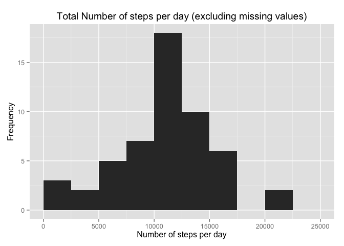
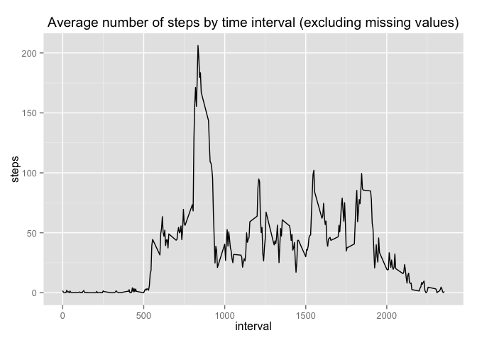
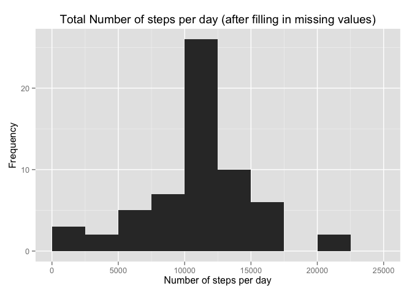
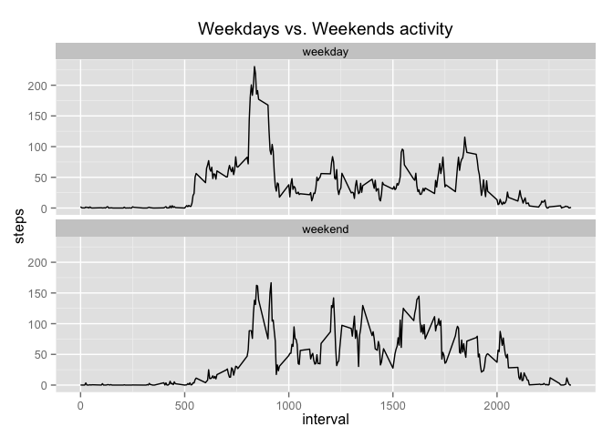

# Reproducible Research: Peer Assessment 1
Federico Roman Demo  

## Introduction

It is now possible to collect a large amount of data about personal movement using activity monitoring devices such as a Fitbit, Nike Fuelband, or Jawbone Up. These type of devices are part of the “quantified self” movement – a group of enthusiasts who take measurements about themselves regularly to improve their health, to find patterns in their behavior, or because they are tech geeks. But these data remain under-utilized both because the raw data are hard to obtain and there is a lack of statistical methods and software for processing and interpreting the data.

This analysis makes use of data from a personal activity monitoring device. This device collects data at 5 minute intervals through out the day. The data consists of two months of data from an anonymous individual collected during the months of October and November, 2012 and include the number of steps taken in 5 minute intervals each day.

## Dataset

The data can be downloaded from here:

Dataset: [Activity monitoring data [52K]](https://d396qusza40orc.cloudfront.net/repdata%2Fdata%2Factivity.zip)

The variables included in this dataset are:

- steps: Number of steps taking in a 5-minute interval (missing values are coded as NA)
- date: The date on which the measurement was taken in YYYY-MM-DD format
- interval: Identifier for the 5-minute interval in which measurement was taken

The dataset is stored in a comma-separated-value (CSV) file and there are a total of 17,568 observations in this dataset.

## Analysis

### Loading and preprocessing the data

We unzip and load the CSV file containing the observations.

```r
if(!file.exists("activity.csv")) {
  unzip("activity.zip")
}

activity<-read.csv("activity.csv", header = TRUE, sep = ",", )
```

We convert dates to date R objects

```r
activity$date <- as.Date(activity$date, "%Y-%m-%d")
head(activity,10)
```

```
##    steps       date interval
## 1     NA 2012-10-01        0
## 2     NA 2012-10-01        5
## 3     NA 2012-10-01       10
## 4     NA 2012-10-01       15
## 5     NA 2012-10-01       20
## 6     NA 2012-10-01       25
## 7     NA 2012-10-01       30
## 8     NA 2012-10-01       35
## 9     NA 2012-10-01       40
## 10    NA 2012-10-01       45
```

### What is mean total number of steps taken per day?

Firstly, we calculate the total number of steps taken each date ignoring NAs values.
Calculate the total number of steps taken per day

```r
activity_no_na <- activity[complete.cases(activity),]
daily_total_activity <- aggregate(activity_no_na["steps"],by=activity_no_na["date"], sum, na.rm=TRUE)
```

We make a histogram of the total number of steps taken each day.

```r
library(ggplot2)
```

```
## Warning: package 'ggplot2' was built under R version 3.1.3
```

```r
ggplot(daily_total_activity, aes(steps)) + geom_histogram(breaks = c(0,2500, 5000, 7500, 10000, 12500, 15000, 17500, 20000,22500, 25000)) + labs(y = expression("Frequency")) + labs(x = expression("Number of steps per day")) + labs(title = expression("Total Number of steps per day (excluding missing values)"))
```

 

We calculate and report the mean and median of the total number of steps taken per day.

```r
mean1<-round(mean(daily_total_activity$steps,na.rm=TRUE),2)
median1<-round(median(daily_total_activity$steps,na.rm=TRUE),2)
```
The mean is **10766.19** and the median is **10765**. 

### What is the average daily activity pattern?

In order to understand the daily activity pattern, we make a time series plot of the 5-minute interval (x-axis) and the average number of steps taken, averaged across all days (excluding NAs values).

```r
avg_per_interval <- aggregate(activity["steps"],by=activity["interval"],mean, na.rm=TRUE)

ggplot(avg_per_interval, aes(interval, steps)) + geom_line() + labs(title = expression("Average number of steps by time interval (excluding missing values)"))
```

 

Which 5-minute interval, on average across all the days in the dataset, contains the maximum number of steps?

```r
avg_per_interval[avg_per_interval["steps"] == max(avg_per_interval["steps"]),]
```

```
##     interval    steps
## 104      835 206.1698
```

### Imputing missing values

The presence of NAs values can introduce some bias into some calculations. Therefore, we fill in the missing values with the mean of the missing 5-minute interval. 

```r
total_na <- sum(is.na(activity$steps))
percent_na <- paste(round(sum(is.na(activity$steps))/nrow(activity),2)*100,"%")
```
There are **2304** missing values in the dataset, which means that **13 %** of the observations in our dataset have missing values for the *steps* variable.

We will generate a new dataset where the NAs values will be replaced with the mean of the 5-minute interval.

```r
new_activity<-activity
  
for (i in 1:length(new_activity$steps)) {
    if (is.na(new_activity[i, 1])) {
        
        steps_average <- subset(avg_per_interval, avg_per_interval$interval == as.numeric(activity[i, 
            3]))$steps
        
        new_activity[i, 1] <- steps_average
    } 
}
count_na <- sum(is.na(new_activity$steps))
```
There are **0** NA values in the dataset, which means that we have all complete cases now.

This is how the new dataset looks like:

```r
head(new_activity)
```

```
##       steps       date interval
## 1 1.7169811 2012-10-01        0
## 2 0.3396226 2012-10-01        5
## 3 0.1320755 2012-10-01       10
## 4 0.1509434 2012-10-01       15
## 5 0.0754717 2012-10-01       20
## 6 2.0943396 2012-10-01       25
```

```r
tail(new_activity)
```

```
##           steps       date interval
## 17563 2.6037736 2012-11-30     2330
## 17564 4.6981132 2012-11-30     2335
## 17565 3.3018868 2012-11-30     2340
## 17566 0.6415094 2012-11-30     2345
## 17567 0.2264151 2012-11-30     2350
## 17568 1.0754717 2012-11-30     2355
```

We make a histogram of the total number of steps taken each day and calculate and report the mean and median total number of steps taken per day. 

```r
daily_total_activity <- aggregate(new_activity["steps"],by=new_activity["date"], sum)

ggplot(daily_total_activity, aes(steps)) + geom_histogram(breaks = c(0,2500, 5000, 7500, 10000, 12500, 15000, 17500, 20000,22500, 25000)) + labs(y = expression("Frequency")) + labs(x = expression("Number of steps per day")) + labs(title = expression("Total Number of steps per day (after filling in missing values)"))
```

 

The distribution doesn’t seem to have changed with the values filled in.

What are the mean and median in the new dataset?

```r
mean2<-round(mean(daily_total_activity$steps),4)
median2<-round(median(daily_total_activity$steps),4)
```
The mean is **10766.19** and the median is **10766.19**. 

What is the impact of imputing missing data on the estimates of the total daily number of steps?

```r
delta_mean<-(mean1-mean2)/mean1
paste(round(100*delta_mean, 4), "%")
```

```
## [1] "0 %"
```

```r
delta_median<-(median1-median2)/median1
paste(round(100*delta_median, 4), "%")
```

```
## [1] "-0.011 %"
```
The variation of the mean and the median after imputing the missing values are respectively 1.2074838\times 10^{-7} and -1.1042267\times 10^{-4}. 

The difference between the original dataset and new one without missing values is very small.

### Are there differences in activity patterns between weekdays and weekends?

We add a new column to the dataset and we classify the observations into *weekend* and *weekday* groups.

```r
weekend_log <- grepl("^[Ss]", weekdays(as.Date(new_activity$date)))

for (i in (1:nrow(new_activity))) {
    if (weekend_log[i] == TRUE) {
        new_activity$day_of_week[i] <- "weekend"
    } else {
        new_activity$day_of_week[i] <- "weekday"
    }
}

head(new_activity,10)
```

```
##        steps       date interval day_of_week
## 1  1.7169811 2012-10-01        0     weekday
## 2  0.3396226 2012-10-01        5     weekday
## 3  0.1320755 2012-10-01       10     weekday
## 4  0.1509434 2012-10-01       15     weekday
## 5  0.0754717 2012-10-01       20     weekday
## 6  2.0943396 2012-10-01       25     weekday
## 7  0.5283019 2012-10-01       30     weekday
## 8  0.8679245 2012-10-01       35     weekday
## 9  0.0000000 2012-10-01       40     weekday
## 10 1.4716981 2012-10-01       45     weekday
```

We compare the pattern between weekdays and weekends.

```r
summary <- aggregate(new_activity$steps, list(interval = new_activity$interval, day = new_activity$day), mean)
names(summary) <- c("interval", "day", "steps")

ggplot(summary, aes(interval, steps)) + geom_line() + facet_wrap(~day, ncol = 1) + labs(title = expression("Weekdays vs. Weekends activity"))
```

 

Even though the average maximum number of steps in any one interval occurs during the week, there is an overall higher number steps taken in the aggregate over the weekend.
